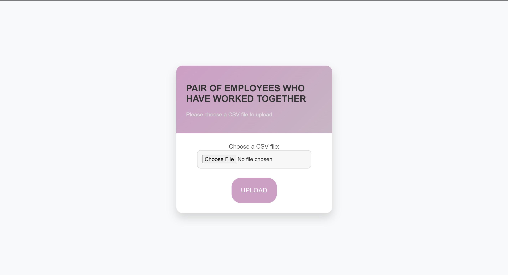
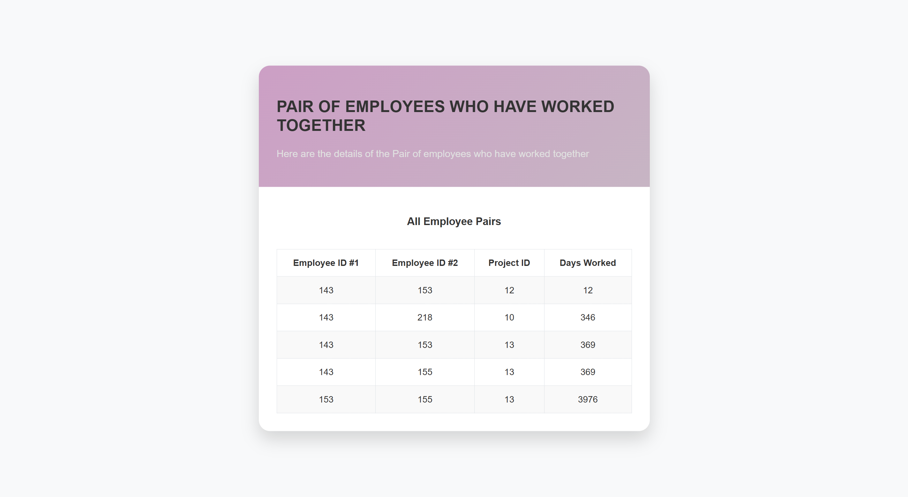

# Pair of Employees Who Have Worked Together

## Overview

This application identifies the pair of employees who have worked together on common projects for the longest period of time.

## Specific Requirements

1. **DateTo Can Be `NULL`, Equivalent to Today's Date**
    - In the input data, the `DateTo` field can be set to `NULL`. When `NULL` is encountered, it is automatically treated as the current date, representing an employee who is still working on the project.

2. **Input Data Loaded from a CSV File**
    - The program accepts input data through a CSV file, where each row represents an employee's work on a specific project, including their start and end dates. The CSV file must follow a specific format with columns: `EmpID`, `ProjectID`, `DateFrom`, and `DateTo`.

3. **Support for Multiple Date Formats**
    - The application supports multiple date formats, allowing flexibility in how dates are provided. Supported formats include, but are not limited to:
        - `YYYY-MM-DD` (e.g., `2020-01-01`)
        - `YYYY/MM/DD` (e.g., `2020/01/01`)
    - The program automatically detects and parses dates in various formats to ensure accurate processing.

